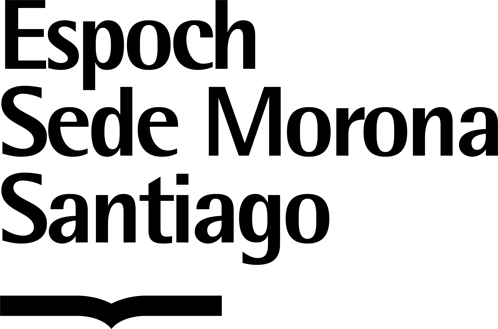
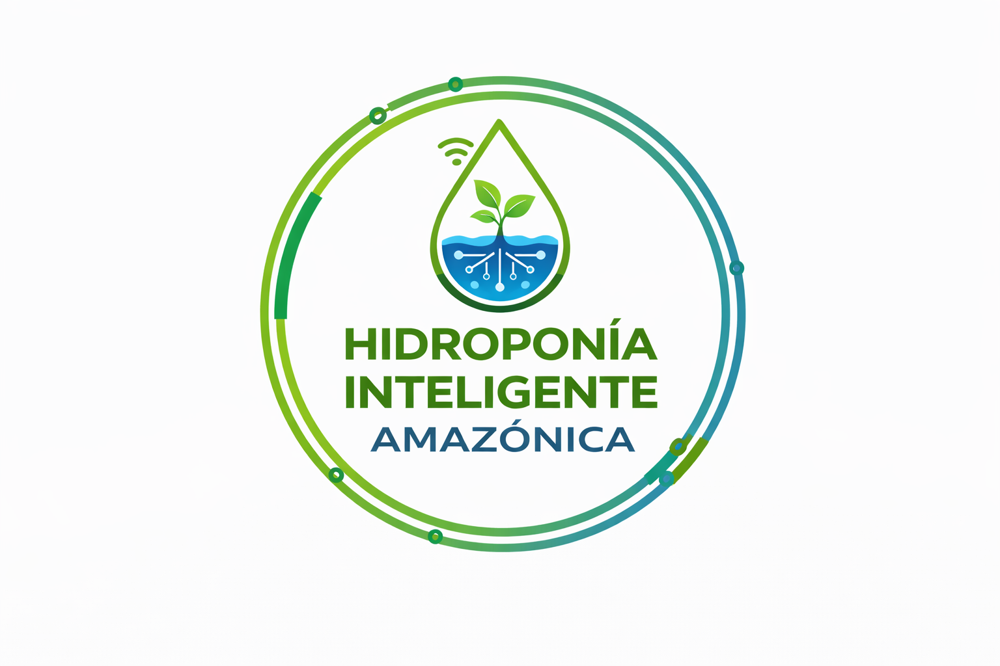
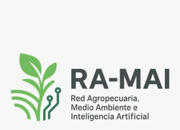

<!DOCTYPE html>
<html lang="es">
<head>
    <meta charset="UTF-8">
    <meta name="viewport" content="width=device-width, initial-scale=1.0">
    
    <!-- SEO Meta Tags -->
    <title>SMART4GREEN 2026 | Seminario Internacional de Innovación para el Desarrollo Sostenible</title>
    <meta name="description" content="Participa en SMART4GREEN 2026, seminario internacional con feria sobre investigación científica, inteligencia artificial, sostenibilidad, innovación tecnológica y emprendimiento organizado por ESPOCH Sede Morona Santiago.">
    <meta name="keywords" content="SMART4GREEN 2026, desarrollo sostenible, inteligencia artificial, IoT, Amazonía, investigación científica, innovación tecnológica, congresos académicos, emprendimiento, sostenibilidad, ESPOCH">
    <meta name="author" content="ESPOCH Sede Morona Santiago">
    <meta name="robots" content="index, follow">

    <!-- Open Graph / Facebook / LinkedIn -->
    <meta property="og:type" content="website">
    <meta property="og:url" content="https://smart4green.espoch.edu.ec/">
    <meta property="og:title" content="SMART4GREEN 2026 | I Seminario Multidisciplinario de Innovación para el Desarrollo Sostenible">
    <meta property="og:description" content="17 de noviembre de 2026. Seminario modalidda híbrida y feria presencial de emprendimientos de 09h00 a 13h00.">
    <meta property="og:image" content="https://images.unsplash.com/photo-1518770660439-4636190af475?auto=format&fit=crop&w=1200&q=80">

    <!-- Twitter -->
    <meta property="twitter:card" content="summary_large_image">
    <meta property="twitter:title" content="SMART4GREEN 2026 | I Seminario Multidisciplinario">
    <meta property="twitter:description" content="Seminario modalidad híbrida el 17 de noviembre de 2026; feria presencial de 09h00 a 13h00.">
    <meta property="twitter:image" content="https://images.unsplash.com/photo-1518770660439-4636190af475?auto=format&fit=crop&w=1200&q=80">

    <!-- Favicon -->
    <link rel="icon" href="https://www.espoch.edu.ec/favicon.ico" type="image/x-icon">

    <!-- Google Fonts -->
    <link rel="preconnect" href="https://fonts.googleapis.com">
    <link rel="preconnect" href="https://fonts.gstatic.com" crossorigin>
    <link href="https://fonts.googleapis.com/css2?family=Montserrat:wght@400;600;700;800&family=Open+Sans:wght@300;400;600;700&display=swap" rel="stylesheet">

    <!-- Bootstrap 5.3 CSS -->
    <link href="https://cdn.jsdelivr.net/npm/bootstrap@5.3.2/dist/css/bootstrap.min.css" rel="stylesheet">

    <!-- Font Awesome 6 Pro / Free Icons -->
    <link rel="stylesheet" href="https://cdnjs.cloudflare.com/ajax/libs/font-awesome/6.4.2/css/all.min.css">

    <!-- AOS (Animate On Scroll) Library -->
    <link href="https://unpkg.com/aos@2.3.1/dist/aos.css" rel="stylesheet">

    <!-- Custom System CSS -->
    
</head>
<body>

    <!-- TOPBAR -->
    

        

            

                <i class="fa-solid fa-graduation-cap me-2"></i> ESPOCH Sede Morona Santiago | Seminario · 17 de noviembre de 2026
            

            

                <i class="fa-regular fa-envelope me-1"></i> investigo@istra.edu.ec
            

        

    

    <!-- NAVBAR STICKY -->
    <nav class="navbar navbar-expand-lg sticky-top navbar-light">
        

            <a class="navbar-brand d-flex align-items-center gap-2" href="#">
                SMART4GREEN
                2026
            </a>
            <button class="navbar-toggler" type="button" data-bs-toggle="collapse" data-bs-target="#navbarNav">
                
            </button>
            

                <ul class="navbar-nav ms-auto align-items-center gap-1">
                    <li class="nav-item"><a class="nav-link" href="#inicio">Inicio</a></li>
                    <li class="nav-item"><a class="nav-link" href="#acerca">Acerca de</a></li>
                    <li class="nav-item"><a class="nav-link" href="#ejes">Ejes Temáticos</a></li>
                    <li class="nav-item"><a class="nav-link" href="#speakers">Speakers</a></li>
                    <li class="nav-item"><a class="nav-link" href="#callforpapers">Call for Papers</a></li>
                    <li class="nav-item"><a class="nav-link" href="#fechas">Fechas</a></li>
                    <li class="nav-item"><a class="nav-link" href="#emprendimiento">Feria Emprendimiento</a></li>
                    <li class="nav-item"><a class="nav-link" href="#programa">Programa</a></li>
                    <li class="nav-item"><a class="nav-link" href="#contacto">Contacto</a></li>
                    <li class="nav-item ms-lg-2">
                        <a href="#callforpapers" class="btn btn-custom-primary btn-sm rounded-pill px-3">Enviar Manuscrito</a>
                    </li>
                </ul>
            

        

    </nav>

    <!-- HERO SECTION FULLSCREEN -->
    <section id="inicio" class="hero-section">
        

            

                

                    
                        <i class="fa-solid fa-globe me-2"></i> Seminario · 17 de noviembre de 2026
                    
                    <h1 class="hero-title mb-3">SMART4GREEN 2026</h1>
                    
I Seminario Multidisciplinario de Innovación para el Desarrollo Sostenible

                    
Tecnología • Producción • Economía • Sociedad • Ambiente

                    
Feria de emprendimientos presencial · 09h00 a 13h00 · Lugar por confirmar

                    
                    <!-- Countdown Timer -->
                    

                        

                            00
                            Días
                        

                        

                            00
                            Horas
                        

                        

                            00
                            Minutos
                        

                        

                            00
                            Segundos
                        

                    

                    

                        <a href="https://forms.gle/oieuCepQ93R2p2tTA"
                           target="_blank"
                           rel="noopener noreferrer"
                           class="btn btn-outline-light btn-sm align-self-center">
                            <i class="fa-solid fa-ticket me-1"></i> Inscripción general
                        </a>
                        </button>
                        <a href="#callforpapers" class="btn btn-custom-primary">
                            <i class="fa-solid fa-paper-plane me-2"></i> Enviar Manuscrito
                        </a>
                        <a href="#emprendimiento" class="btn btn-custom-secondary">
                            <i class="fa-solid fa-lightbulb me-2"></i> Feria de Emprendimiento
                        </a>
                        <a href="#programa" class="btn btn-custom-outline">
                            <i class="fa-regular fa-calendar-check me-2"></i> Ver Programa
                        </a>
                    

                

            

        

    </section>

    <!-- HIGHLIGHT FEATURES STRIP -->
    <section class="py-4 bg-white shadow-sm border-bottom">
        

            

                

                    

                        <i class="fa-solid fa-earth-americas text-primary fs-3"></i>
                        17 de noviembre de 2026
                    

                

                

                    

                        <i class="fa-solid fa-chalkboard-user text-success fs-3"></i>
                        Feria Presencial
                    

                

                

                    

                        <i class="fa-solid fa-microchip text-info fs-3"></i>
                        IA & Monitoreo IoT
                    

                

                

                    

                        <i class="fa-solid fa-people-arrows text-warning fs-3"></i>
                        Networking Académico
                    

                

            

        

    </section>

    <!-- ACERCA DEL SEMINARIO -->
    <section id="acerca" class="py-5">
        

            

                

                    Sobre el Evento
                    <h2 class="section-title text-start mb-4">Promoviendo la Investigación Científica y la Sostenibilidad Amazónica</h2>
                    

                        El <strong>SMART4GREEN 2026</strong> se constituye como un espacio internacional multidisciplinario diseñado para articular la investigación académica con el desarrollo sostenible en el contexto global y regional.
                    

                    

                        Organizado por la <strong>ESPOCH Sede Morona Santiago</strong>, el seminario integra proyectos estratégicos como el <em>"Sistema Inteligente de Monitoreo de la Calidad Ambiental en Ecosistemas Amazónicos mediante IoT e Inteligencia Artificial"</em> y la <em>"Hidroponía Inteligente Amazónica"</em>.
                    

                    

                        

                            

                                <h6 class="fw-bold text-success mb-1">Impacto Ambiental</h6>
                                
Protección ecosistémica mediante sensores de última generación.

                            

                        

                        

                            

                                <h6 class="fw-bold text-primary mb-1">Transformación Digital</h6>
                                
Aplicación de modelos de Inteligencia Artificial.

                            

                        

                    

                

                

                    

                        

                            <h5 class="fw-bold mb-3"><i class="fa-solid fa-users text-primary me-2"></i>Público Objetivo</h5>
                        

                        

                            

                                <i class="fa-solid fa-user-graduate text-success fs-2 mb-2"></i>
                                <h6 class="fw-bold mb-0">Investigadores y Docentes</h6>
                            

                        

                        

                            

                                <i class="fa-solid fa-book-reader text-info fs-2 mb-2"></i>
                                <h6 class="fw-bold mb-0">Estudiantes</h6>
                            

                        

                        

                            

                                <i class="fa-solid fa-briefcase text-warning fs-2 mb-2"></i>
                                <h6 class="fw-bold mb-0">Profesionales y Empresas</h6>
                            

                        

                        

                            

                                <i class="fa-solid fa-building-columns text-primary fs-2 mb-2"></i>
                                <h6 class="fw-bold mb-0">Instituciones Públicas / Privadas</h6>
                            

                        

                    

                

            

        

    </section>

    <!-- EJES TEMÁTICOS -->
    <section id="ejes" class="py-5 bg-white">
        

            

                Áreas de Investigación
                <h2 class="section-title">Ejes Temáticos del Evento</h2>
            

            

                <!-- Eje 1 -->
                

                    

                        
<i class="fa-solid fa-robot"></i>

                        <h5 class="fw-bold">1. Tecnología, IA y Digitalización</h5>
                        
Inteligencia Artificial, Internet de las Cosas (IoT), Transformación Digital y Big Data aplicados al desarrollo.

                    

                

                <!-- Eje 2 -->
                

                    

                        
<i class="fa-solid fa-leaf"></i>

                        <h5 class="fw-bold">2. Ambiente y Sostenibilidad</h5>
                        
Monitoreo ambiental, conservación de la biodiversidad, cambio climático y resiliencia ecológica.

                    

                

                <!-- Eje 3 -->
                

                    

                        
<i class="fa-solid fa-gem"></i>

                        <h5 class="fw-bold">3. Recursos Naturales y Territorio</h5>
                        
Minería responsable, gestión territorial sostenible y preservación de cuencas hidrográficas.

                    

                

                <!-- Eje 4 -->
                

                    

                        
<i class="fa-solid fa-wheat-awn"></i>

                        <h5 class="fw-bold">4. Producción y Zootecnia</h5>
                        
Agropecuaria de precisión, hidroponía inteligente y sistemas agroforestales sostenibles.

                    

                

                <!-- Eje 5 -->
                

                    

                        
<i class="fa-solid fa-chart-line"></i>

                        <h5 class="fw-bold">5. Economía y Negocios Sostenibles</h5>
                        
Economía circular, contabilidad ambiental, finanzas verdes y modelos de negocios sustentables.

                    

                

                <!-- Eje 6 -->
                

                    

                        
<i class="fa-solid fa-scale-balanced"></i>

                        <h5 class="fw-bold">6. Derecho, Sociedad y Gobernanza</h5>
                        
Políticas públicas, bioética, gobernanza territorial y legislación ambiental.

                    

                

                <!-- Eje 7 -->
                

                    

                        
<i class="fa-solid fa-rocket"></i>

                        <h5 class="fw-bold">7. Innovación, Emprendimiento y Desarrollo Sostenible</h5>
                        
Modelos de transferencia tecnológica, incubación de empresas sostenibles y soluciones innovadoras para comunidades amazónicas.

                    

                

            

        

    </section>

    <!-- KEYNOTE SPEAKERS -->
    <section id="speakers" class="py-5">
        

            

                
                <h2 class="section-title">Keynote Speakers</h2>
            

            

                <!-- Speaker 1 -->
                

                    

                        

                            
                            🇮🇹
                        

                        

                            <h4 class="fw-bold mb-1">Ing. Omar Delgado, PhD.</h4>
                            
Università della Calabria, Italia

                            

                            
<strong>Especialidad:</strong> Inteligencia Artificial, Sistemas Inteligentes, Transformación Digital y Tecnologías Emergentes.

                            <button class="btn btn-sm btn-outline-primary rounded-pill mt-2" data-bs-toggle="modal" data-bs-target="#modalSpeaker1">Ver Bio Completa</button>
                        

                    

                

                <!-- Speaker 2 -->
                

                    

                        

                            <i class="fa-solid fa-user-tie text-success" style="font-size: 5rem;" aria-hidden="true"></i>
                        

                        

                            Por confirmar
                            <h4 class="fw-bold mb-1">Keynote Speaker 3</h4>
                            
Afiliación por confirmar

                            

                            
<strong>Tema:</strong> Por confirmar.

                        

                    

                

                <!-- Speaker 3: por confirmar -->
                

                    

                        

                            <i class="fa-solid fa-user-tie text-success" style="font-size: 5rem;" aria-hidden="true"></i>
                        

                        

                            Por confirmar
                            <h4 class="fw-bold mb-1">Keynote Speaker 3</h4>
                            
Afiliación por confirmar

                            

                            
<strong>Tema:</strong> Por confirmar.

                        

                    

                

            

        

    </section>

    <!-- CALL FOR PAPERS -->
    <section id="callforpapers" class="py-5 bg-white">
        

            

                Convocatoria Científica Abierta
                <h2 class="fw-bold display-6 mb-3">Call for Papers</h2>
                
Invitamos a investigadores, académicos y profesionales a presentar trabajos originales e inéditos en las áreas temáticas de SMART4GREEN 2026.

            

            

                

                    

                        <h3 class="fw-bold mb-3">Recepción de Artículos Científicos</h3>
                        
Los manuscritos presentados serán sometidos a evaluación académica. <strong></strong>

                        

                            
<i class="fa-solid fa-circle-check text-warning me-2"></i>Revisión Científica Rigurosa

                            
<i class="fa-solid fa-circle-check text-warning me-2"></i>Publicación de Trabajos Aceptados

                            
<i class="fa-solid fa-circle-check text-warning me-2"></i>Certificación Digital

                            
<i class="fa-solid fa-circle-check text-warning me-2"></i>Difusión Académica

                        

                    

                    

                        <i class="fa-solid fa-file-signature" style="font-size: 8rem; opacity: .25;" aria-hidden="true"></i>
                    

                

            

            

                

                    

                        Revista Oficial
                        <h3 class="fw-bold mb-2">INVESTIGO</h3>
                        
Revista Científica Multidisciplinaria

                        
<i class="fa-solid fa-barcode me-2"></i>ISSN 2953-6367

                        <a href="http://revistainvestigo.com" target="_blank" rel="noopener noreferrer" class="btn btn-outline-primary"><i class="fa-solid fa-arrow-up-right-from-square me-2"></i>Visitar Sitio Web Revista</a>
                    

                

                

                    

                        <h3 class="fw-bold mb-4">Requisitos de Presentación de Documentos</h3>
                        <ul class="list-unstyled mb-4">
                            <li class="mb-3"><i class="fa-solid fa-check text-success me-2"></i><strong>Idioma oficial:</strong> Español.</li>
                            <li class="mb-3"><i class="fa-solid fa-check text-success me-2"></i><strong>Extensión:</strong> Máximo 10 páginas utilizando la plantilla.</li>
                            <li class="mb-3"><i class="fa-solid fa-check text-success me-2"></i><strong>Formatos requeridos:</strong> PDF y editable en Word (.docx).</li>
                        </ul>
                        

                            <a href="documentos/Plantilla para el desarrollo de artículos científicos InvestiGo.docx" class="btn btn-dark" download>
                                <i class="fa-solid fa-download me-2"></i>Plantilla de Artículo
                            </a>
                            <a href="documentos/Ficha de Información para autores y evaluadores InvestiGo.docx" class="btn btn-outline-dark" download>
                                <i class="fa-solid fa-download me-2"></i>Ficha de Autor
                            </a>
                            <a href="documentos/Originalidad y cesión de derechos de articulo.docx" class="btn btn-outline-dark" download>
                                <i class="fa-solid fa-download me-2"></i>Declaración de Originalidad
                            </a>
                        

                    

                

            

            

                <h4 class="fw-bold mb-2">¿Listo para presentar tu investigación?</h4>
                
Consulta los requisitos y envía tu manuscrito para participar en SMART4GREEN 2026.

                <button class="btn btn-warning btn-lg fw-bold px-5 text-dark" data-bs-toggle="modal" data-bs-target="#modalSubmitPaper"><i class="fa-solid fa-file-arrow-up me-2"></i>Enviar Manuscrito Ahora</button>
            

        

    </section>

    <!-- FECHAS IMPORTANTES (TIMELINE) -->
    <section id="fechas" class="py-5">
        

            

                Cronograma Académico
                <h2 class="section-title">Fechas Importantes</h2>
            

            

                

                    

                    

                        Límite de Envío
                        <h5 class="fw-bold mb-1">Envío de Manuscritos</h5>
                        
<i class="fa-regular fa-calendar me-2"></i>30 de Octubre de 2026

                    

                

                

                    

                    

                        Evaluación
                        <h5 class="fw-bold mb-1">Notificación de Aceptación</h5>
                        
<i class="fa-regular fa-calendar me-2"></i>06 de Noviembre de 2026

                    

                

                

                    

                    

                        Cámara Lista
                        <h5 class="fw-bold mb-1">Entrega de Versión Final</h5>
                        
<i class="fa-regular fa-calendar me-2"></i>13 de Noviembre de 2026

                    

                

                

                    

                    

                        Evento Vivo
                        <h5 class="fw-bold mb-1">Desarrollo de SMART4GREEN 2026</h5>
                        
<i class="fa-regular fa-calendar me-2"></i>17 de noviembre de 2026

                    

                

            

        

    </section>

    <!-- FERIA DE EMPRENDIMIENTOS -->
    <section id="emprendimiento" class="py-5">
        

            

                I Feria de Emprendimientos SMART4GREEN 2026
                <h2 class="section-title">Convierte una idea en una solución para el futuro.</h2>
                
<i class="fa-regular fa-calendar me-2"></i><strong>17 de noviembre de 2026 · 09h00–13h00</strong> · Modalidad presencial · Lugar por confirmar.

            

            

                

                    

                        <h4 class="fw-bold text-success mb-3"><i class="fa-solid fa-seedling me-2"></i>Feria de Emprendimientos SMART4GREEN 2026</h4>
                        
La Feria de Emprendimientos SMART4GREEN 2026 es un espacio para presentar ideas de negocio, proyectos innovadores y soluciones con potencial de impacto, vinculadas con la sostenibilidad, tecnología, producción, economía, sociedad y ambiente.

                        

                        <h6 class="fw-bold text-dark"></h6>
                        <ul class="small text-muted mb-4">
                            <li><strong>¿Quiénes pueden participar?</strong> Estudiantes, docentes, investigadores y emprendedores podrán participar mediante equipos de hasta 4 integrantes.</li>
                            <li>
                                <strong>Áreas de participación:</strong> Sostenibilidad y ambiente · Tecnología e innovación · Producción y agroindustria ·  Minería sostenible · Economía y negocios · Innovación social y jurídica.
                            </li>
                        </ul>

                        

                            
Descarga el formato obligatorio para la propuesta:

                            <a href="documentos/Plantilla_Feria_Emprendimientos_SMART4GREEN_2026.docx"
                               class="btn btn-outline-success btn-sm"
                               download>
                                <i class="fa-solid fa-file-pdf me-1"></i> Descargar Formato
                            </a>
                        

                    

                

                
                <!-- Inscripción mediante Google Forms: allí se recopilan los datos y el PDF. -->
                

                    

                        Inscripciones abiertas
                        <h4 class="fw-bold mb-3">Inscripción a la Feria de Emprendimientos</h4>
                        
Completa el formulario de inscripción y adjunta tu propuesta ejecutiva en PDF.

                        
La propuesta se entrega dentro del formulario. Para subir el archivo, Google puede solicitar que inicies sesión con tu cuenta.

                        <a href="https://forms.gle/fv8FkEfTR3pD16yw5" target="_blank" rel="noopener noreferrer" class="btn btn-custom-primary btn-lg align-self-start">
                            <i class="fa-solid fa-arrow-up-right-from-square me-2"></i> Inscribirme en la Feria
                        </a>
                    

                

            

        

    </section>

    <!-- PROGRAMA DEL EVENTO -->
    <section id="programa" class="py-5 bg-white">
        

            

                17 de noviembre de 2026 · Hora de Ecuador
                <h2 class="section-title">Programa del Evento</h2>
                
Conferencias y ponencias científicas modalidad híbrida. La feria de emprendimientos se realizará en paralelo, de 09h00 a 13h00, en modalidad presencial. Lugar por confirmar.

            

            

                    
09h00–09h20<strong>Keynote 1</strong>

                    
09h30–09h50<strong>Keynote 2</strong>

                    
10h00–10h20<strong>Keynote 3</strong>

                    
10h30–10h50<strong>Paper 1</strong>

                    
11h00–11h20<strong>Paper 2</strong>

                    
11h30–11h50<strong>Paper 3</strong>

                    
12h00–12h20<strong>Paper 4</strong>

                    
12h30–14h00<strong>Almuerzo libre</strong>

                    
14h00–14h20<strong>Paper 5</strong>

                    
14h30–14h50<strong>Paper 6</strong>

                    
15h00–15h20<strong>Paper 7</strong>

                    
16h30–16h50<strong>Paper 8</strong>

                    
17h00–17h20<strong>Paper 9</strong>

                    
17h30–17h50<strong>Paper 10</strong>

                    
18h00<strong>Cierre del evento</strong>

            

        

    </section>

    <!-- ESTADÍSTICAS ANIMADAS -->
    <section class="stats-section">
        

            

                

                    
0

                    
Participantes

                

                

                    
0

                    
Instituciones Participantes

                

                

                    
0

                    
Países Representados

                

                

                    
0

                    
Artículos & Emprendimientos

                

            

        

    </section>

    <!-- ORGANIZADORES & REDES -->
    <section class="py-5">
        

            

                Respaldo Institucional
                <h2 class="section-title">Organizadores y Redes Académicas</h2>
            

            <!-- Guarde los logos en assets/logos/ con los nombres indicados en cada src. -->
            <h3 class="h4 fw-bold text-center mt-5 mb-4">Institución organizadora</h3>
            

                

                    <article class="partner-card">
                        

                            
                            <i class="fa-solid fa-university" aria-hidden="true"></i>
                        

                        <h4 class="h5 fw-bold">Escuela Superior Politécnica de Chimborazo (ESPOCH)</h4>
                        
Sede Morona Santiago

                    </article>
                

            

            <h3 class="h4 fw-bold text-center mt-5 mb-4">Proyectos participantes</h3>
            

                

                    <article class="partner-card">
                        

                            
                            <i class="fa-solid fa-diagram-project" aria-hidden="true"></i>
                        

                        <h4 class="h5 fw-bold">Proyecto de Investigación</h4>
                        
Desarrollo e Implementación de un Sistema Inteligente de Monitoreo de la Calidad Ambiental en Ecosistemas Amazónicos mediante Tecnologías IoT e Inteligencia Artificial.

                    </article>
                

                

                    <article class="partner-card">
                        

                            
                            <i class="fa-solid fa-seedling" aria-hidden="true"></i>
                        

                        <h4 class="h5 fw-bold">Proyecto de Vinculación</h4>
                        
Hidroponía Inteligente Amazónica.

                    </article>
                

            

            <h3 class="h4 fw-bold text-center mt-5 mb-4">Redes y Grupos de Investigación</h3>
            

                

                    <article class="partner-card">
                        

                            
                            <i class="fa-solid fa-network-wired" aria-hidden="true"></i>
                        

                        <h4 class="h5 fw-bold">Red RAMAI</h4>
                        
Red Agropecuaria, Medio Ambiente e Inteligencia Artificial

                    </article>
                

                

                    <article class="partner-card">
                        

                            
                            <i class="fa-solid fa-microscope" aria-hidden="true"></i>
                        

                        <h4 class="h5 fw-bold">IITMS</h4>
                        
Grupo de Investigación Innovación y Tecnología Morona Santiago

                    </article>
                

                

                    <article class="partner-card">
                        

                            
                            <i class="fa-solid fa-microchip" aria-hidden="true"></i>
                        

                        <h4 class="h5 fw-bold">AMAZONAIOT</h4>

                    </article>
                

            

            <!-- Patrocinadores: sustituya los archivos en assets/logos/ por los logos oficiales. -->
            <!-- EMPRESAS PATROCINADORAS -->
            

                

                    Patrocinio
                    <h3 class="h4 fw-bold">Empresas patrocinadoras</h3>
                

                

                    <!-- NEOIA -->
                    

                        <a href="https://URL-OFICIAL-DE-NEOIA"
                           target="_blank"
                           rel="noopener noreferrer"
                           class="text-decoration-none text-reset d-block h-100">
                            <article class="partner-card">
                                

                                    
                                    <i class="fa-solid fa-handshake" aria-hidden="true"></i>
                                

                                <h4 class="h5 fw-bold mb-0">NEOIA</h4>
                            </article>
                        </a>
                    

                    <!-- ELECTROSTORE -->
                    

                        <a href="https://www.grupoelectrostore.com/"
                           target="_blank"
                           rel="noopener noreferrer"
                           class="text-decoration-none text-reset d-block h-100">
                            <article class="partner-card">
                                

                                    
                                    <i class="fa-solid fa-handshake" aria-hidden="true"></i>
                                

                                <h4 class="h5 fw-bold mb-0">Electrostore</h4>
                            </article>
                        </a>
                    

                    <!-- DRON -->
                    

                        <a href="https://URL-OFICIAL-DE-DRON"
                           target="_blank"
                           rel="noopener noreferrer"
                           class="text-decoration-none text-reset d-block h-100">
                            <article class="partner-card">
                                

                                    
                                    <i class="fa-solid fa-handshake" aria-hidden="true"></i>
                                

                                <h4 class="h5 fw-bold mb-0">DRON</h4>
                            </article>
                        </a>
                    

                    <!-- MICROCIRCUITOS -->
                    

                        <a href="https://www.pcbmicrocircuitos.com/en"
                           target="_blank"
                           rel="noopener noreferrer"
                           class="text-decoration-none text-reset d-block h-100">
                            <article class="partner-card">
                                

                                    
                                    <i class="fa-solid fa-handshake" aria-hidden="true"></i>
                                

                                <h4 class="h5 fw-bold mb-0">Microcircuitos</h4>
                            </article>
                        </a>
                    

                

            

</section>

    <!-- CONTACTO Y MAPA -->
    <section id="contacto" class="py-5">
        

            

                

                    Canales Oficiales
                    <h2 class="section-title text-start mb-4">Contáctate con Nosotros</h2>
                    
Si tienes dudas sobre el envío de manuscritos o la postulación de emprendimientos, escríbenos a los correos institucionales.

                    
                    

                        <i class="fa-solid fa-envelope text-primary fs-4 me-3"></i>
                        

                            <strong>Correos Electrónicos:</strong> 
                            macarena.flores@espoch.edu.ec | carlav.haro@espoch.edu.ec | juanpablo.haro@espoch.edu.ec
                        

                    

                    

                        <i class="fa-brands fa-facebook text-primary fs-4 me-3"></i>
                        

                            <strong>Facebook Oficial:</strong> 
                            <a href="https://www.facebook.com/espochms?locale=es_LA" target="_blank" rel="noopener" class="text-decoration-none">ESPOCH Sede Morona Santiago</a>
                        

                    

                    

                        <h6 class="fw-bold mb-2"><i class="fa-solid fa-location-dot me-2 text-danger"></i>Ubicación Sede</h6>
                        
Macas, Morona Santiago, Ecuador — Escuela Superior Politécnica de Chimborazo.

                    

                

                

                    

                        <h4 class="fw-bold mb-3">Enviar Mensaje Directo</h4>
                        <form id="formContacto" novalidate>
                            

                                <label class="form-label fw-semibold">Nombre Completo</label>
                                <input type="text" class="form-control" required placeholder="Tu nombre">
                            

                            

                                <label class="form-label fw-semibold">Correo Electrónico</label>
                                <input type="email" class="form-control" required placeholder="tu@correo.com">
                            

                            

                                <label class="form-label fw-semibold">Asunto</label>
                                <input type="text" class="form-control" required placeholder="Consulta sobre manuscritos / evento">
                            

                            

                                <label class="form-label fw-semibold">Mensaje</label>
                                <textarea class="form-control" rows="4" required placeholder="Escribe tu mensaje..."></textarea>
                            

                            <button type="submit" class="btn btn-custom-secondary w-100">Enviar Consulta</button>
                        </form>
                    

                

            

        

    </section>

    <!-- FOOTER -->
    <footer class="bg-dark text-white pt-5 pb-3">
        

            

                

                    <h5 class="fw-bold text-success mb-2">SMART4GREEN 2026</h5>
                    
I Seminario Multidisciplinario de Innovación para el Desarrollo Sostenible. ESPOCH Sede Morona Santiago.

                

                

                    
Indexación e Investigación:

                    ERIHPLUS
                    Google Schoolar
                    ISSN 2953-6367
                

            

            

                &copy; 2026 SMART4GREEN. Todos los derechos reservados. Desarrollado para la Escuela Superior Politécnica de Chimborazo.
            

        

    </footer>

    <!-- BOTÓN DE WHATSAPP FLOTANTE -->
    <a href="https://wa.me/593996381808?text=Hola,%20deseo%20información%20sobre%20SMART4GREEN%202026" class="whatsapp-float" target="_blank" rel="noopener" aria-label="Contacto por WhatsApp">
        <i class="fa-brands fa-whatsapp"></i>
    </a>

    <!-- VOLVER ARRIBA -->
    <a href="#inicio" class="back-to-top" id="backToTop" aria-label="Volver arriba">
        <i class="fa-solid fa-arrow-up"></i>
    </a>

    <!-- MODALES -->
    <!-- Modal Paper Submission -->
    

        

            

                

                    <h5 class="modal-heading fw-bold">Envío de Manuscrito Científico</h5>
                    <button type="button" class="btn-close" data-bs-dismiss="modal" aria-label="Close"></button>
                

                

                    
Para enviar su manuscrito, asegúrese de cumplir con la plantilla oficial y remitir los 3 documentos requeridos en formato digital a los correos oficializados:

                    

                        <code>investigo@istra.edu.ec</code> 
                        <code>macarena.flores@espoch.edu.ec</code> 
                        <code>carlav.haro@espoch.edu.ec</code>
                    

                    
Documentos adjuntos obligatorios:

                    <ol>
                        <li>Artículo Científico (Word y PDF).</li>
                        <li>Ficha de información para autores.</li>
                        <li>Declaración de originalidad y cesión de derechos.</li>
                    </ol>
                

                

                    <button type="button" class="btn btn-secondary btn-sm" data-bs-dismiss="modal">Cerrar</button>
                

            

        

    

    <!-- Bootstrap 5.3 JS Bundle -->
    
    
    <!-- AOS Library -->
    

    <!-- Custom Script ES6 -->
    
</body>
</html>
